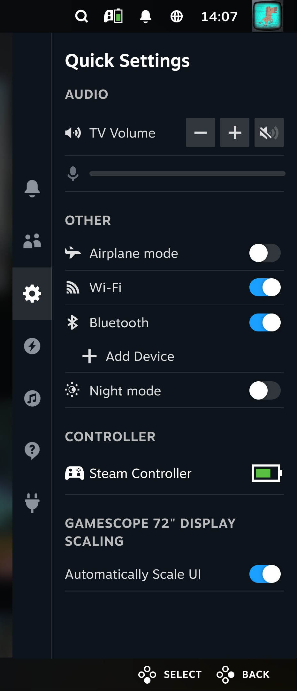
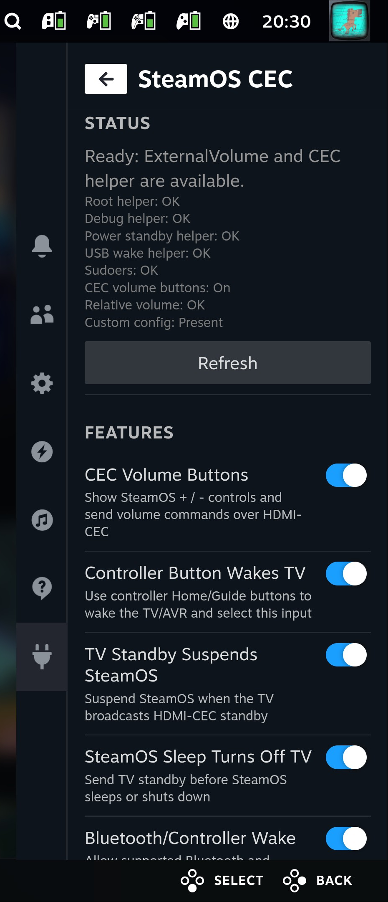
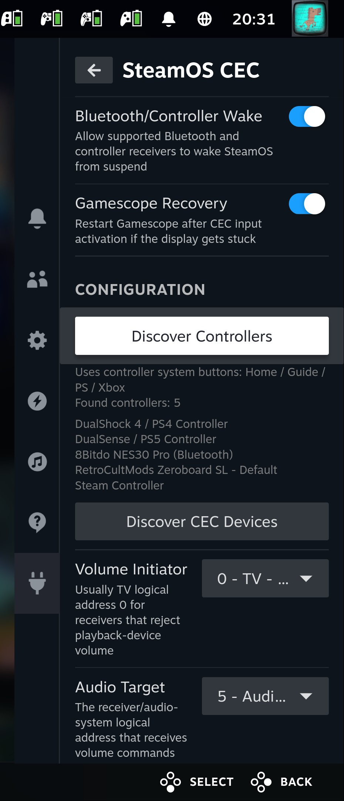
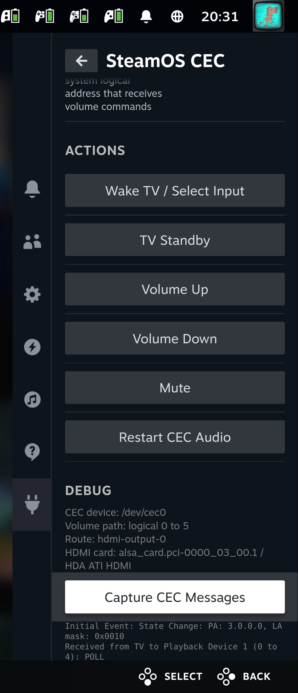

# SteamOS CEC Toolkit

> Disclaimer: This is a community solution for DIY/self-installed SteamOS
> machines, created with vibe-coding and Codex. It is not an official Valve
> project, and is tested on one known-good HTPC setup: a Radeon 9070 XT system
> with a UGREEN DisplayPort-to-HDMI CEC adapter exposing `/dev/cec0`.

SteamOS CEC Toolkit adds living-room HDMI-CEC behavior to DIY SteamOS /
Steam Machine / HTPC builds. It installs scripts, systemd units, WirePlumber
overrides, and a Decky plugin so Game Mode can control the TV/AVR chain like a
console.

It was built for a living-room SteamOS box where:

- A controller Home/Guide/Steam-button press should wake/power on the TV/AVR
  over HDMI-CEC and switch the active input back to the SteamOS box.
- SteamOS should be able to send TV standby when the system sleeps or shuts
  down.
- SteamOS can optionally suspend when the TV broadcasts HDMI-CEC standby.
- Supported Bluetooth adapters and controller receivers can optionally be set up
  to wake SteamOS from suspend before the toolkit sends CEC wake/input
  selection.
- Gamescope can optionally be recovered after CEC wake/input switching if the
  display comes back in a bad state.
- SteamOS Game Mode can show relative volume controls (`+` / `-`) instead of a
  normal software volume slider, and those buttons can control the real
  receiver / soundbar volume over HDMI-CEC.
- The original Steam Controller has a HID fallback profile for wake/input
  switching if Linux does not expose a normal gamepad Home button event.

Features are configurable and can be toggled on or off from the Decky plugin
after the toolkit has been installed.

The project uses Valve's existing SteamOS CEC daemon (`cecd`) and PipeWire
ExternalVolume plumbing.

## Screenshots

<table>
  <tr>
    <td></td>
    <td></td>
  </tr>
  <tr>
    <td></td>
    <td></td>
  </tr>
</table>

## Install

Run this on the SteamOS machine as the normal desktop user, usually `deck`:

```bash
bash <(curl -fsSL https://github.com/Twsts/steamos-cec-toolkit/releases/latest/download/steamos-cec-toolkit-installer.sh)
```

The installer will:

- download the latest release assets
- ask which features you want to enable
- install the CEC volume shim and root helpers
- install the Decky plugin
- discover CEC devices where possible
- restart Decky Loader

After installation, open Game Mode and use the `SteamOS CEC` Decky plugin:

1. Open `Configuration`.
2. Press `Discover CEC Devices`.
3. Use `Actions` to test wake/input selection.
4. If you want SteamOS volume buttons to control CEC audio, run
   `Discover Audio Output`, confirm `Volume Initiator`, `Audio Target`, and
   `HDMI Audio Card`, then test volume.
5. Toggle the features you want under `Features`.

If the plugin does not appear immediately, restart Steam or reboot.

Development builds can be installed from `main` with:

```bash
bash <(curl -fsSL https://raw.githubusercontent.com/Twsts/steamos-cec-toolkit/main/scripts/easy-install.sh)
```

## Requirements

- SteamOS / Steam Deck-style Game Mode on a DIY HTPC.
- Decky Loader already installed.
- A working CEC adapter exposed as `/dev/cec0` or similar.
- A TV/AVR/soundbar HDMI-CEC chain.
- `git`, `curl`, `sudo`, `systemctl`, and `unzip` available on the SteamOS
  desktop session.

## Hardware This Targets

Known-good reference setup:

- SteamOS / Steam Deck-style Game Mode on a DIY HTPC.
- UGREEN DisplayPort-to-HDMI adapter with HDMI-CEC support.
- TV + AVR/soundbar HDMI-CEC chain.
- Gamepad Home/Guide button support through Linux input events.
- Steam Controller for the Steam Controller HID fallback helper.

Controller wake from suspend has been tested on the reference setup with:

- Sony DualSense / PS5 controller over Bluetooth.
- Sony DualShock 4 / PS4 controller over Bluetooth.
- Original Steam Controller.
- 8BitDo controller over Bluetooth.

Other adapters and controllers may work, but you should verify the CEC topology
and whether the controller exposes a normal gamepad Home/Guide input event.

## What It Installs

User files:

```text
~/.local/bin/steamos-cec-volume
~/.local/bin/steamos-cec-external-volume
~/.local/bin/steamos-cec-steam-button
~/.local/bin/steamos-cec-tv-standby-suspend
~/.local/bin/steamos-cec-gamescope-recovery
~/.config/systemd/user/cec-audio-control.service.d/override.conf
~/.config/systemd/user/steamos-cec-*.service
~/.config/wireplumber/wireplumber.conf.d/99-steamos-cec-external-volume.conf
```

Controller wake support is passive. It does not remap, inject, block, or grab
controller input. The generic path watches gamepad-like Linux input devices for
known system button codes (`BTN_MODE`, `KEY_HOMEPAGE`, `KEY_HOME`) and ignores
keyboard/mouse devices. The Steam Controller fallback still uses the original
Steam Controller HID profile.

Root files:

```text
/etc/steamos-cec-toolkit.conf
/etc/sudoers.d/zz-steamos-cec-toolkit-volume
/var/lib/steamos-cec-toolkit/steamos-cec-volume-raw
/var/lib/steamos-cec-toolkit/steamos-cec-before-sleep
/var/lib/steamos-cec-toolkit/steamos-cec-permissions-apply
/var/lib/steamos-cec-toolkit/steamos-cec-usb-wake-apply
/etc/systemd/system/steamos-cec-before-sleep.service
/etc/systemd/system/steamos-cec-permissions.service
/etc/systemd/system/steamos-cec-usb-wake.service
/etc/udev/rules.d/70-steamos-cec-toolkit.rules
```

USB/Bluetooth wake from suspend depends on the USB/Bluetooth adapter, firmware,
kernel, and controller. The toolkit can enable Linux USB wakeup for matching
Bluetooth/controller receivers, but it cannot make unsupported hardware wake the
PC from suspend. By default it matches USB Bluetooth radios by Bluetooth device
class, controller receiver names, and a small known-safe USB ID list for devices
that do not expose a readable product name.

CEC device access can also change after suspend, hotplug, or a SteamOS update.
The toolkit installs a small root helper, systemd unit, and udev rule to keep
the configured `/dev/cec*` device readable and writable by the SteamOS desktop
user so the user-level `cecd` service can reattach the adapter.

## SteamOS Updates and Recovery

SteamOS updates can replace or reset parts of the system image. User files in
`/home/deck` usually survive, but anything under `/etc`, `/var/lib`, systemd
unit state, WirePlumber behavior, Decky Loader, or SteamOS CEC internals may
change after an OS update.

Common symptoms after an update:

- Game Mode goes back to the normal volume slider.
- The `SteamOS CEC` Decky plugin shows `Missing` for a helper or sudoers rule.
- Feature toggles are present but do not do anything.
- CEC discovery works, but volume or TV standby actions fail.
- Decky Loader itself needs to be reinstalled or restarted.

The Decky plugin is the first place to check:

- `Root helper`, `Debug helper`, `Power standby helper`, and `Sudoers` should be
  `OK`.
- `CEC volume buttons` should be `On` if you want `+ / -` instead of the normal
  slider.
- `Relative volume` should be `OK` when ExternalVolume is active.
- If the `Install` section appears, it lists what is missing.

The normal repair step is simply to rerun the latest installer:

```bash
bash <(curl -fsSL https://github.com/Twsts/steamos-cec-toolkit/releases/latest/download/steamos-cec-toolkit-installer.sh)
```

This refreshes the root helpers, sudoers rule, systemd units, WirePlumber
override, CEC device permission repair, and Decky plugin. It keeps your runtime
choices in:

```text
~/.config/steamos-cec-toolkit/config.conf
```

After rerunning the installer, open the plugin, run `Discover CEC Devices`, and
toggle your preferred features back on if needed.

## Why Relative Volume Needs a Shim

SteamOS has an official user service:

```text
/usr/lib/systemd/user/cec-audio-control.socket
/usr/lib/systemd/user/cec-audio-control.service
```

It exposes a Varlink interface:

```text
org.pipewire.ExternalVolume
```

WirePlumber can attach this ExternalVolume socket to the HDMI ALSA card. When
Steam sees usable relative-volume capabilities, Game Mode changes from a normal
volume slider to `+` / `-`.

Some AVRs ignore CEC volume commands from the SteamOS playback device logical
address, but accept the exact same command when it is sent as if it came from
the TV logical address. The toolkit replaces the `cec-audio-control` service
with a small Varlink shim that still speaks `org.pipewire.ExternalVolume`, but
uses `cec-ctl --raw-msg -f <initiator> -t <audio-system>` for volume.

Default behavior:

```text
initiator: 0  (TV)
target:    5  (Audio System)
```

## Quick Install

Most users should use the one-command installer above.

Manual install:

Clone the repo on the SteamOS machine as the `deck` user:

```bash
git clone https://github.com/Twsts/steamos-cec-toolkit.git
cd steamos-cec-toolkit
```

Install the ExternalVolume integration and controller TV wake/input-switch
helper:

```bash
./install.sh --enable-steam-button
```

Install everything:

```bash
./install.sh \
  --enable-steam-button \
  --enable-tv-standby-suspend \
  --enable-gamescope-recovery \
  --enable-before-sleep \
  --enable-usb-wake
```

Then restart Steam/Game Mode or reboot.

## Release Assets

Each GitHub release should include:

```text
steamos-cec-toolkit-installer.sh
steamos-cec-toolkit-decky.zip
steamos-cec-toolkit.tar.gz
SHA256SUMS
```

Build them from a clean checkout:

```bash
scripts/build-release-assets.sh v0.1.0
```

Upload example:

```bash
gh release create v0.1.0 \
  release/steamos-cec-toolkit-installer.sh \
  release/steamos-cec-toolkit-decky.zip \
  release/steamos-cec-toolkit.tar.gz \
  release/SHA256SUMS \
  --title "v0.1.0"
```

## Decky Plugin

This repository also includes an early Decky plugin under:

```text
decky/
```

The plugin is a Game Mode control panel for an already bootstrapped toolkit. It
can:

- show ExternalVolume/toolkit status
- toggle SteamOS CEC volume buttons on/off so you can switch between relative
  `+ / -` control and the normal SteamOS volume bar
- toggle controller wake/input switching, TV standby suspend, SteamOS
  sleep/shutdown TV standby, Bluetooth/controller wake from suspend, and
  Gamescope recovery
- discover CEC devices and choose the volume initiator/audio target from
  dropdowns
- test TV wake/input selection
- test volume up/down/mute
- restart the CEC audio/WirePlumber path

The plugin intentionally does not create sudoers rules or write root-owned
system files. Install the toolkit from Desktop/SSH first, then use the plugin
for day-to-day control. Runtime choices made in the plugin are written to:

```text
~/.config/steamos-cec-toolkit/config.conf
```

Build the plugin:

```bash
cd decky
npm install
npm run build
```

For local testing, install the built Decky plugin using Decky Loader developer
tools or copy the plugin directory according to your Decky development workflow.

## Configure Your Machine

The installer creates:

```text
/etc/steamos-cec-toolkit.conf
```

The Decky plugin can write user-level overrides for common runtime choices. For
system defaults, edit:

```bash
sudoedit /etc/steamos-cec-toolkit.conf
```

Important defaults:

```bash
CEC_DEVICE=/dev/cec0
STEAMOS_CEC_USER=deck
CEC_VOLUME_INITIATOR=0
CEC_AUDIO_LOGICAL_ADDRESS=5
HDMI_ALSA_CARD_NAME=alsa_card.pci-0000_03_00.1
HDMI_ALSA_CARD_NICK="HDA ATI HDMI"
EXTERNAL_VOLUME_ROUTE=hdmi-output-0
```

Find CEC topology:

```bash
cec-ctl -d /dev/cec0 --show-topology
```

Find the HDMI ALSA card:

```bash
wpctl status
pw-cli ls Device
```

After changing config, rerun the installer or regenerate the WirePlumber file:

```bash
./install.sh --enable-steam-button
```

## Verify ExternalVolume

Check the Varlink capabilities:

```bash
varlinkctl call \
  unix:/run/user/1000/cec-audio-control/org.pipewire.ExternalVolume \
  org.pipewire.ExternalVolume.GetCapabilities \
  '{"device":""}'
```

Expected output includes:

```json
{
  "writeVolumeRelative": true,
  "writeVolumeRelativeStep": { "min": 1.0, "max": 1.0 },
  "writeMuteToggle": true,
  "routes": ["hdmi-output-0"]
}
```

Test volume:

```bash
varlinkctl call \
  unix:/run/user/1000/cec-audio-control/org.pipewire.ExternalVolume \
  org.pipewire.ExternalVolume.WriteVolumeRelative \
  '{"device":"","route":"hdmi-output-0","step":1.0}'
```

If the receiver volume moves, the shim is working.

## CEC Debug Capture

The Decky plugin has a Debug panel that can capture a short window of live CEC
messages. This uses a narrow root helper because `cec-ctl --monitor-all`
normally requires root on SteamOS.

From SSH/Desktop you can run the same capture manually:

```bash
~/.local/bin/steamos-cec-toolkitctl debug-cec 3
```

The capture window is intentionally limited to 1-5 seconds. It is meant for
checking routing, source activation, standby broadcasts, and volume commands
without leaving a long-running root monitor behind.

## Hardware and Topology Notes

The defaults match a common UGREEN DP-to-HDMI CEC adapter setup where SteamOS is
a playback device, the TV is logical address `0`, and the receiver/audio system
is logical address `5`. Other HDMI chains can differ.

Check topology:

```bash
cec-ctl -d /dev/cec0 --show-topology
```

Then update `/etc/steamos-cec-toolkit.conf` if needed:

```bash
CEC_DEVICE=/dev/cec0
CEC_VOLUME_INITIATOR=0
CEC_AUDIO_LOGICAL_ADDRESS=5
HDMI_ALSA_CARD_NAME=alsa_card.pci-0000_03_00.1
HDMI_ALSA_CARD_NICK="HDA ATI HDMI"
EXTERNAL_VOLUME_ROUTE=hdmi-output-0
```

The toolkit is configurable, but not fully topology-agnostic yet. In
particular, some receivers accept volume only from the TV logical address while
others may accept it from the SteamOS playback address. HDMI/WirePlumber card
matching can also vary by GPU, adapter, and distro image.

## Controller Wake and Input Switching

The `steamos-cec-steam-button` service watches controller Home/Guide input
events from gamepad-like Linux input devices. It also keeps the original Steam
Controller HID profile as a fallback. When triggered, it wakes/powers on the
TV/AVR chain and activates the SteamOS HDMI source by calling SteamOS `cecd`:

```bash
busctl --user call \
  com.steampowered.CecDaemon1 \
  /com/steampowered/CecDaemon1/Daemon \
  com.steampowered.CecDaemon1.Daemon1 \
  Wake
```

It triggers on:

- supported controller Home/Guide button events
- original Steam Controller connect/resume
- original Steam Controller short Steam-button press

On a working CEC topology this is the same behavior users expect from a console:
press the controller button, the display wakes, the AVR/TV selects the SteamOS
input, and Game Mode appears.

The Steam Controller HID fallback uses this default report parsing:

```bash
STEAM_BUTTON_HID_ID=0003:000028DE:00001304
STEAM_BUTTON_REPORT_ID=0x45
STEAM_BUTTON_BYTE=4
STEAM_BUTTON_MASK=0x01
```

Other controllers use the generic gamepad Home/Guide input-event path when
Linux exposes a supported system button event.

On the reference setup, suspend wake plus CEC TV/input activation has been
tested with DualSense, DualShock 4, Steam Controller, and 8BitDo controllers.
This depends on the Bluetooth/USB adapter being allowed to wake the machine from
suspend, so unsupported adapters may still need platform-specific tuning.

## Optional TV Standby Suspend

Enable with:

```bash
./install.sh --enable-tv-standby-suspend
```

This listens for TV broadcast standby:

```text
source:      0  (TV)
destination: 15 (broadcast)
opcode:      0x36 (Standby)
```

Then it runs:

```bash
systemctl suspend
```

## Optional SteamOS Sleep/Shutdown CEC Standby

Enable with:

```bash
./install.sh --enable-before-sleep
```

This installs a system service and a `systemd/system-sleep` hook that ask
`cecd` to send TV standby before SteamOS sleeps or shuts down. The Decky plugin
can toggle it after the root helper and system unit have been installed.

## Optional Gamescope Recovery

Enable with:

```bash
./install.sh --enable-gamescope-recovery
```

This watches the `Active` property from `cecd`. When this source becomes active,
it can restart `gamescope-session.target` after a short delay. This is useful on
some HTPC setups where switching back to the SteamOS input leaves Game Mode in a
bad display state.

When enabled, the same service also runs one cooldown-protected recovery after
system resume. This handles cases where SteamOS wakes from a Bluetooth/controller
event, CEC already thinks the SteamOS source is active, but the TV still shows no
video.

Configure the connector status path in:

```bash
GAMESCOPE_CONNECTOR_STATUS=/sys/class/drm/card0-DP-1/status
GAMESCOPE_RECOVER_AFTER_RESUME=1
```

## Logs

```bash
journalctl --user -b -u cec-audio-control.service --no-pager
journalctl --user -b -u steamos-cec-steam-button.service --no-pager
journalctl --user -b -u steamos-cec-tv-standby-suspend.service --no-pager
journalctl --user -b -u steamos-cec-gamescope-recovery.service --no-pager
journalctl --user -b -u wireplumber.service --no-pager
```

## Uninstall

```bash
./uninstall.sh
```

Also remove `/etc/steamos-cec-toolkit.conf`:

```bash
./uninstall.sh --remove-config
```

## Safety Notes

This project grants passwordless sudo only for fixed toolkit helpers:

```text
/var/lib/steamos-cec-toolkit/steamos-cec-volume-raw *
/var/lib/steamos-cec-toolkit/steamos-cec-debug-monitor *
/var/lib/steamos-cec-toolkit/steamos-cec-power-standby-control *
/var/lib/steamos-cec-toolkit/steamos-cec-usb-wake-control *
```

These helpers validate their limited subcommands and should not be replaced by
broader shell access. Do not broaden the sudoers rule.

## License

MIT. See [LICENSE](LICENSE).
